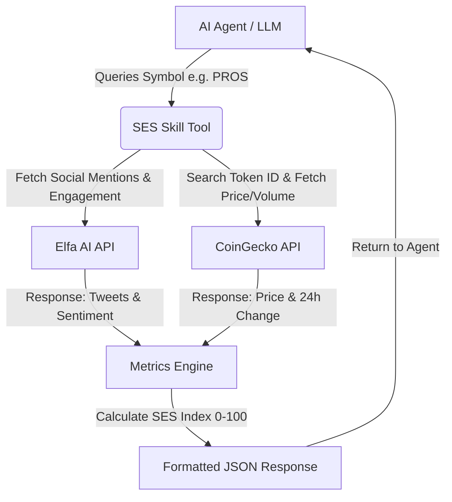

# Pharos Social-Economic Sentinel (SES) Skill

A production-grade, highly reusable **Social-Economic Sentinel (SES) Skill** built for the **Pharos Network AI Agent Carnival (Phase 1)**. 

This Skill fuses live Twitter/Telegram social sentiment (via **Elfa AI**) and real-time market metrics (via **CoinGecko**) into a unified **SES Index** (0-100 score). This enables downstream AI agents to dynamically evaluate token hype vs. price momentum before performing on-chain transactions.

---

## Technical Architecture



### The SES Index Formula

$$\text{SES Index} = \text{Market Momentum (0-50)} + \text{Social Buzz (0-25)} + \text{Sentiment Quality (0-25)}$$

1.  **Market Momentum Score (0-50)**: Base score is 25. Adds or subtracts `1.5` points per 1% change in price over 24 hours, clamped between 0 and 50.
2.  **Social Buzz Score (0-25)**: Logarithmically scaled count of mentions: $\min(25, \log_2(\text{mentions} + 1) \times 5)$.
3.  **Sentiment Quality Score (0-25)**: Ratio of positive mentions to total classified mentions multiplied by 25.

---

## Project Setup

### 1. Clone the Repository
```bash
git clone https://github.com/web3ammie/social-economic-sentinel-skill.git
cd social-economic-sentinel-skill
```

### 2. Install Dependencies
```bash
npm install
```

### 2. Configure Environment Variables
Copy `.env.example` to `.env` and fill in the required credentials:
```bash
cp .env.example .env
```
Key configuration items:
*   `PHAROS_PRIVATE_KEY`: Your wallet's private key for Spire Testnet.
*   `ELFA_AI_API_KEY`: Your developer API token from [Elfa AI Dev Portal](https://dev.elfa.ai).
*   `COINGECKO_API_KEY`: Optional CoinGecko API key (fallback uses their public rate-limited endpoints).
*   `OPENAI_API_KEY`: Required to run the showcase agent loop.

---

## Tool API Reference

### Input Schema (Zod)
```json
{
  "tokenSymbol": "string (e.g. 'PROS', 'ETH', 'BTC')",
  "timeframe": "enum ['1h', '24h', '7d'] (default: '24h')"
}
```

### Output Schema (JSON)
```json
{
  "success": true,
  "symbol": "PROS",
  "coinGeckoName": "Prosper",
  "coinGeckoId": "prosper",
  "priceUsd": 0.452,
  "change24h": 4.85,
  "volume24h": 1250000,
  "socialMentionsCount": 12,
  "socialEngagementSum": 140,
  "socialSentimentRatio": 0.75,
  "sesIndex": 62,
  "recommendation": "Moderate Bullish",
  "recommendationDetail": "Positive market movement with growing social chatter. Stable accumulation phase.",
  "recentMentions": [
    {
      "text": "Bullish breakout coming for $PROS soon!",
      "user": "crypto_trader_1",
      "engagement": 45
    }
  ]
}
```

## Integrating with Your Agent

The Social-Economic Sentinel is packaged to support all major AI Agent frameworks in the JS/TS ecosystem:

### 1. LangChain (Standard pharos-agent-kit Integration)
If you are using the standard LangChain-based `pharos-agent-kit` stack:

```javascript
const { PharosAgentKit, createPharosTools } = require("pharos-agent-kit");
const { ChatOpenAI } = require("@langchain/openai");
const { createReactAgent, AgentExecutor } = require("langchain/agents");
const { sesSkillTool } = require("./src/skills/sesSkill");

// Initialize agent and default tools
const agentKit = new PharosAgentKit(process.env.PHAROS_PRIVATE_KEY, process.env.RPC_URL);
const defaultTools = createPharosTools(agentKit);

// Register the Sentinel tool along with default tools
const allTools = [...defaultTools, sesSkillTool];

const llm = new ChatOpenAI({ modelName: "gpt-4o-mini" });
```

### 2. Vercel AI SDK Integration
If you are building your agent using the **Vercel AI SDK** (popular with Next.js/React apps):

```javascript
import { tool } from "ai";
import { z } from "zod";
import { sesSkillTool } from "./src/skills/sesSkill";

export const socialEconomicSentinelTool = tool({
  description: "Queries live social sentiment (Elfa AI) and market price changes (CoinGecko) for any crypto token.",
  parameters: z.object({
    tokenSymbol: z.string().describe("The ticker symbol of the token (e.g. PROS)"),
    timeframe: z.enum(["1h", "24h", "7d"]).optional().default("24h")
  }),
  execute: async ({ tokenSymbol, timeframe }) => {
    // Unwraps the tool execution logic directly
    const result = await sesSkillTool.func({ tokenSymbol, timeframe });
    return JSON.parse(result);
  }
});
```

### 3. Model Context Protocol (MCP) & Anvita Flow Schema
For one-click deployment into **Anvita Flow** or an MCP server, the tool exposes a standard JSON-RPC schema configuration:

```json
{
  "name": "social_economic_sentinel",
  "description": "Queries live social sentiment and market price changes for any crypto token to return a unified momentum indicator (SES Index).",
  "inputSchema": {
    "type": "object",
    "properties": {
      "tokenSymbol": {
        "type": "string",
        "description": "The ticker symbol of the token to analyze"
      },
      "timeframe": {
        "type": "string",
        "enum": ["1h", "24h", "7d"],
        "default": "24h",
        "description": "The timeframe to track social media mentions"
      }
    },
    "required": ["tokenSymbol"]
  }
}
```

---

## Execution

### Run the Showcase Agent
```bash
node index.js
```
*If `OPENAI_API_KEY` is missing, the script executes a manual dry-run of the SES Skill tool.*

### Run the Security & Scoring Tests
We use Jest to run unit tests verifying calculations and schema stability:
```bash
npm test
```
